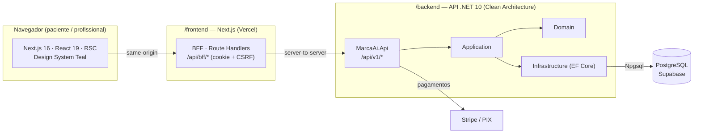

<div align="center">

# 🩺 MarcaAí

**A plataforma de agendamento e recebimento feita para clínicas e consultórios.**

Seus pacientes agendam e pagam pelo seu link. Você recebe com repasse transparente —
sem trocas de mensagens, ligações perdidas ou horários em conflito.

[](#-stack)
[](#-stack)
[-4169E1?logo=postgresql)](#-stack)
[](docs/adrs/0006-design-system-healthtech.md)
[](#-segurança--conformidade)

</div>

---

## 📖 Sobre

O **MarcaAí** é um SaaS de HealthTech que resolve a rotina de agendamento de profissionais e clínicas
de saúde de ponta a ponta:

- **Agenda sem conflitos** — disponibilidade por profissional, buffers, antecedência mínima.
- **Equipe da clínica** — múltiplos profissionais, papéis e permissões (RBAC).
- **Recebimento transparente** — o paciente paga no agendamento (PIX/cartão) e o repasse (bruto,
  taxa e líquido) fica sempre à vista.
- **Tipos de consulta** — retorno, primeira consulta, avaliação, cada um com duração/valor/modalidade.
- **Confiança clínica** — conforme a **LGPD**, identidade visual "clinicamente limpa" (Design System
  Teal, ver [ADR-0006](docs/adrs/0006-design-system-healthtech.md)).

> Toda nova clínica começa com **30 dias de teste grátis** dos recursos premium.

---

## 🏗️ Arquitetura

O produto é um **monorepo** com dois aplicativos independentes que se comunicam por HTTP. O frontend
**nunca** fala direto com o banco: leituras são feitas em RSC (Server Components) e as escritas passam
por um **BFF** (Backend-for-Frontend, Route Handlers same-origin) que injeta cookie/CSRF e repassa para
a API .NET. A API concentra toda a regra de negócio (Clean Architecture) e é a **fonte da verdade**.



### Fluxo de dados (resumo)

| Operação | Caminho |
|---|---|
| **Leitura** (dashboard, perfil) | RSC → `serverApiFetch` → `GET /api/v1/*` |
| **Escrita** (mutations) | Client → **BFF** `/api/bff/*` → API .NET (cookie `HttpOnly` + `X-XSRF-TOKEN`) |
| **Público/sem sessão** (booking) | Proxies dedicados `/api/book/*`, `/api/slots` → API .NET |
| **Sessão** | Cookie `HttpOnly` `marcaai_at` emitido pela API; refresh só em Route Handler |

---

## 🧰 Stack

| Camada | Tecnologias |
|---|---|
| **Frontend** | Next.js 16 (App Router, RSC) · React 19 · TypeScript strict · Tailwind v4 (CSS-first) · Framer Motion (`motion` v12) · React Hook Form + Zod · Radix UI · recharts |
| **Backend** | .NET 10 · C# · Clean Architecture (Api / Application / Domain / Infrastructure) · EF Core (Npgsql) |
| **Banco** | PostgreSQL — **Supabase** (Session pooler, porta 5432); migrations aplicadas no boot |
| **Pagamentos** | Stripe (cartão + Elements) · PIX |
| **Deploy** | Frontend na **Vercel** · Backend em container (Docker / Render) |

---

## 📁 Estrutura do repositório

```
marcaAi/
├── frontend/          # App Next.js (App Router, BFF, Design System) — package.json, configs
│   ├── app/           # Rotas (público, dashboard, BFF em app/api/bff)
│   ├── components/    # Primitivas de UI (button, input, dialog) + features
│   ├── lib/           # api/, actions/, plans/, validators/, auth/
│   └── tests/         # vitest (unit/integration) + Playwright (e2e)
│
├── backend/           # API .NET 10 (Clean Architecture)
│   ├── src/
│   │   ├── MarcaAi.Api/            # Host + Controllers (Program.cs)
│   │   ├── MarcaAi.Application/    # Casos de uso
│   │   ├── MarcaAi.Domain/         # Entidades e regras
│   │   └── MarcaAi.Infrastructure/ # EF Core, repositórios, integrações
│   ├── MarcaAi.sln
│   └── Dockerfile
│
├── docs/              # Specs, ADRs (decisões de arquitetura) e backlog
└── README.md          # (este arquivo)
```

---

## 🚀 Rodando localmente

### Pré-requisitos

- **.NET SDK 10** — para a API
- **Node.js 20+** e **npm** — para o frontend
- **PostgreSQL** — uma instância local **ou** um projeto **Supabase** (recomendado)

### 1️⃣ Backend (API .NET) — suba primeiro

O frontend depende da API em `http://localhost:5080`, então comece por ela.

```bash
cd backend

# Configure a string de conexão (Supabase Session pooler ou Postgres local).
# Em dev, use os User Secrets do .NET (não vaza no git) OU appsettings.Development.json:
dotnet user-secrets set "ConnectionStrings:Default" \
  "Host=localhost;Port=5432;Database=marcaai;Username=postgres;Password=postgres" \
  --project src/MarcaAi.Api

# Restaura, aplica migrations no boot e sobe a API (ouve em http://localhost:5080).
dotnet restore
dotnet run --project src/MarcaAi.Api
```

> As migrations do EF Core são aplicadas **automaticamente no boot** (`db.Database.Migrate()`).
> A API expõe as rotas sob o prefixo **`/api/v1`**.

### 2️⃣ Frontend (Next.js) — em outro terminal

```bash
cd frontend

# Variáveis de ambiente
cp .env.example .env       # e ajuste os valores (ver tabela abaixo)

# Dependências e dev server (http://localhost:3000)
npm install
npm run dev
```

Abra **http://localhost:3000**. Pronto — a home, o login (magic link) e o dashboard já consomem a API.

### Variáveis de ambiente principais (`frontend/.env`)

| Variável | Obrigatória | Descrição |
|---|---|---|
| `NEXT_PUBLIC_API_URL` | ✅ | Base da API .NET **sem** `/api/v1` e **sem** barra final. Default: `http://localhost:5080`. Em produção, use a URL **pública** do backend (senão o SSR na Vercel dá `ECONNREFUSED`). |
| `NEXT_PUBLIC_APP_URL` | ✅ | URL pública do frontend (links de agendamento, callbacks). Ex.: `http://localhost:3000`. |
| `NEXT_PUBLIC_STRIPE_PUBLISHABLE_KEY` | condicional | Chave pública do Stripe, só se o checkout com cartão estiver ativo. |

---

## 🧪 Scripts úteis (dentro de `frontend/`)

```bash
npm run dev            # Dev server
npm run build          # Build de produção
npm run lint           # ESLint
npm run test           # Testes unitários (vitest)
npm run test:e2e       # Testes end-to-end (Playwright)
```

Backend:

```bash
dotnet build backend/MarcaAi.sln          # Compila a solução
dotnet test  backend/MarcaAi.sln          # Testes do backend (se presentes)
```

---

## 🔒 Segurança & conformidade

- **LGPD** — dados de pacientes tratados com base legal, minimização e segurança de ponta a ponta.
- **Sessão** — cookie `HttpOnly` emitido pela API; proteção CSRF via header `X-XSRF-TOKEN` ⟷ cookie.
- **Split transparente** — bruto, taxa e líquido de cada consulta sempre visíveis; nada de letra miúda.
- **Acessibilidade** — WCAG **AA** (foco visível, alvos ≥ 44px, contraste ≥ 4.5:1) em todo o produto.

---

## 📚 Documentação

- [`docs/future-phases-spec.md`](docs/future-phases-spec.md) — estado do projeto e roadmap por fases.
- [`docs/adrs/`](docs/adrs/) — Architecture Decision Records (decisões e trade-offs).
  - Destaque: [ADR-0006 — Design System Healthtech](docs/adrs/0006-design-system-healthtech.md).
- [`docs/backend-backlog.md`](docs/backend-backlog.md) — gaps de backend abertos.

---

<div align="center">
<sub>Feito com 💚 para clínicas e profissionais de saúde. © 2026 MarcaAí.</sub>
</div>
